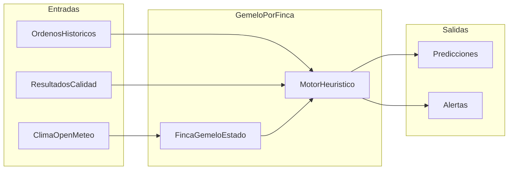
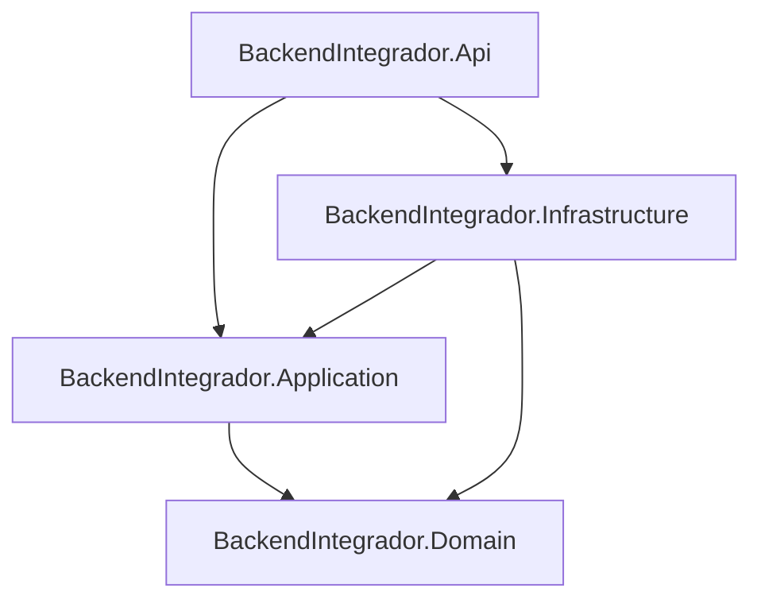
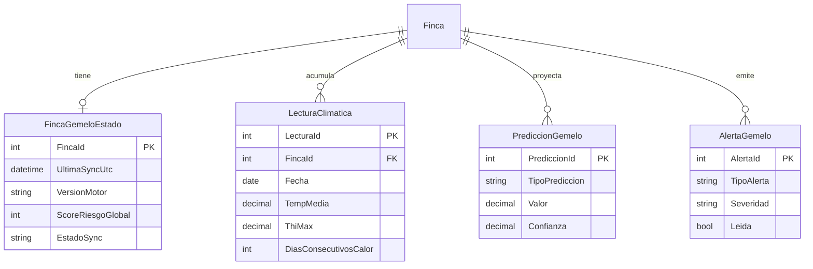
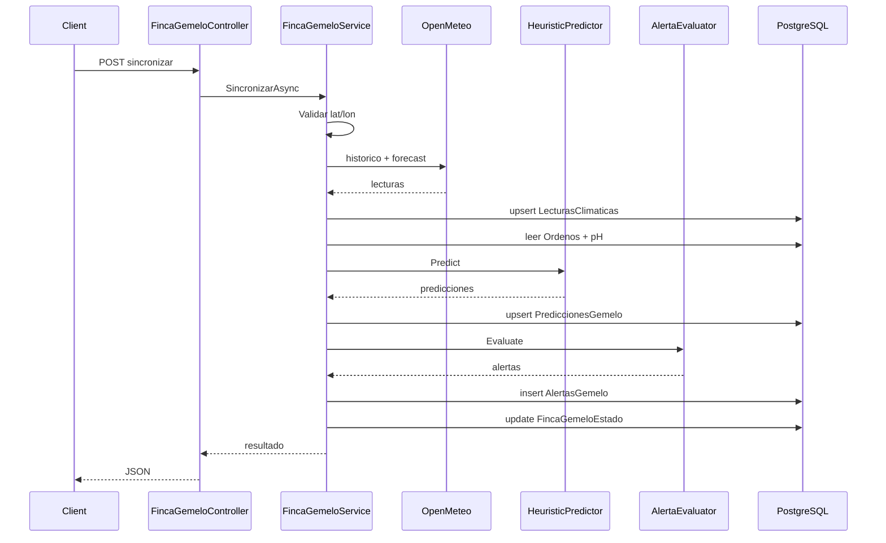

# Informe de visión — Gemelo Digital (Control Lácteo)

**Proyecto:** BackendIntegrador — Portal Control Lácteo  
**Módulo:** Gemelo Digital (Digital Twin)  
**Versión del documento:** 1.0  
**Motor analítico:** heuristic-v1  

---

## Resumen ejecutivo

El Gemelo Digital es la evolución analítica del portal **Control Lácteo**: una capa predictiva que, por cada **finca**, correlaciona el **clima** con la **producción lechera** y la **calidad láctea** para emitir **predicciones** y **alertas preventivas**. No sustituye la trazabilidad transaccional existente; la complementa con inteligencia operativa orientada a la toma de decisiones antes de que se materialicen pérdidas por calidad o volumen.

Este informe se divide en dos partes:

- **Parte I — Visión conceptual:** qué se simula, objetivos, casos de uso, visualización por rol y valor agregado.
- **Parte II — Descripción técnica:** cómo se implementó el modelo en .NET 8 para cumplir esa visión.

---

# Parte I — Visión conceptual

## 1. Introducción y contexto

El portal **Control Lácteo** gestiona el ciclo completo del proceso lechero: productores, fincas, ordeños, lotes, transporte, recepción en acopio, muestras y análisis de calidad. Hasta la incorporación del Gemelo Digital, el sistema respondía principalmente a la pregunta *«¿qué ocurrió?»* mediante registros históricos y trazabilidad.

El Gemelo Digital introduce la capacidad de responder *«¿qué podría ocurrir?»* y *«qué conviene hacer ahora?»*, apoyándose en:

- Datos **internos** ya existentes (ordeños, resultados de calidad por finca).
- Datos **externos** climáticos (Open-Meteo: histórico y pronóstico por coordenadas GPS de la finca).

---

## 2. ¿Qué es el Gemelo Digital en este proyecto?

En Control Lácteo, un **gemelo digital** es la **representación virtual de una finca** (`FincaId`) que mantiene:

1. Un **estado** (última sincronización, score de riesgo, salud del motor).
2. Una **serie temporal climática** (lecturas diarias por ubicación geográfica).
3. **Predicciones** heurísticas sobre producción y riesgo de calidad.
4. **Alertas** accionables con recomendaciones preventivas.

La unidad gemela **no es** el productor, el centro de acopio ni la región completa: es **cada finca productiva** con coordenadas GPS. Un productor con tres fincas tiene tres gemelos independientes.

### Premisas de diseño (innegociables)


| Premisa                  | Descripción                                               |
| ------------------------ | --------------------------------------------------------- |
| **Enfoque principal**    | Clima y ambiente → impacto en calidad y producción láctea |
| **Restricción negativa** | No logística, transporte, rutas ni optimización de flotas |


---

## 3. ¿Qué se simula?

### 3.1 Variables de entrada


| Origen                           | Variable                                          | Uso en el gemelo                   |
| -------------------------------- | ------------------------------------------------- | ---------------------------------- |
| **Open-Meteo** (externo)         | Temperatura mín/máx/media, humedad, precipitación | Contexto climático diario          |
| **Derivado**                     | Índice THI (estrés térmico)                       | Detección de olas de calor         |
| **Derivado**                     | Días consecutivos con THI elevado                 | Riesgo sostenido                   |
| **Ordeno** (interno)             | VolumenLitros, fechas (últimos 14 días)           | Media móvil de producción          |
| **ResultadoParametro** (interno) | Acidez (pH), otros parámetros configurables       | Tendencia de calidad               |
| **Finca**                        | Latitud, Longitud, MunicipioId                    | Georreferencia y contexto regional |


### 3.2 Variables de salida


| Salida                   | Descripción                                       | Unidad / escala               |
| ------------------------ | ------------------------------------------------- | ----------------------------- |
| **volumen_produccion**   | Volumen diario proyectado                         | L/día                         |
| **riesgo_acidificacion** | Probabilidad/score de desviación en pH            | 0–100                         |
| **score_riesgo_global**  | Agregado de riesgo climático + calidad            | 0–100                         |
| **Alertas**              | Eventos preventivos con severidad y recomendación | baja / media / alta / critica |


### 3.3 Qué NO se simula

Para mantener el alcance académico y el foco de negocio, el gemelo **excluye explícitamente**:

- Diseño de rutas de transporte.
- Tiempos de tránsito o cadena de frío logística.
- Optimización de flotas o recepción en acopio como eje central.
- Simulación 3D de instalaciones o ganado individual.

La entidad `Lote` se utiliza únicamente como **puente de trazabilidad** hacia resultados de calidad y, en el caso del centro de acopio, para identificar fincas con historial de entrega — no como dominio logístico del gemelo.

---

## 4. Objetivos

### 4.1 Objetivo general

Dotar al portal Control Lácteo de una capa de **inteligencia predictiva y preventiva** que permita a productores y centros de acopio anticipar el impacto del clima sobre la producción y la calidad de la leche.

### 4.2 Objetivos específicos


| #   | Objetivo                                                    | Indicador de cumplimiento (MVP)                    |
| --- | ----------------------------------------------------------- | -------------------------------------------------- |
| O1  | Correlacionar clima histórico/pronóstico con datos de finca | Lecturas climáticas persistidas por finca/día      |
| O2  | Proyectar volumen de producción bajo estrés térmico         | Predicción `volumen_produccion` con confianza      |
| O3  | Alertar riesgo de acidificación por ola de calor            | Alerta `ola_calor_acidificacion` con recomendación |
| O4  | Ofrecer vista agregada regional al centro de acopio         | Endpoint `riesgo-regional` por fincas asociadas    |
| O5  | Integrarse sin degradar la API transaccional                | Módulo aislado, sync on-demand, misma PostgreSQL   |


---

## 5. Unidad gemela y ciclo de vida

### 5.1 Modelo conceptual




### 5.2 Ciclo de vida


| Fase                      | Descripción                                                                                         |
| ------------------------- | --------------------------------------------------------------------------------------------------- |
| **Creación implícita**    | Al primera sincronización exitosa se crea `FincaGemeloEstado`                                       |
| **Sincronización**        | `POST /api/fincas/{id}/gemelo/sincronizar` — obtiene clima, recalcula predicciones y evalúa alertas |
| **Consulta**              | Endpoints GET de estado, clima, predicciones y alertas (datos cacheados en BD)                      |
| **Expiración de alertas** | Alertas con `ExpiraUtc`; pueden marcarse como leídas                                                |


**Requisito previo:** la finca debe tener `Latitud` y `Longitud` definidas. Sin coordenadas GPS, la sincronización se rechaza con error descriptivo.

---

## 6. Casos de uso y valor agregado

### CU-1 — Alerta de acidificación por ola de calor (Productor)


| Aspecto                | Detalle                                                                                       |
| ---------------------- | --------------------------------------------------------------------------------------------- |
| **Actor**              | Productor (dueño de la finca)                                                                 |
| **Trigger**            | THI ≥ 72 durante ≥ 3 días consecutivos + tendencia de caída de pH en análisis recientes       |
| **Acción del sistema** | Crea alerta `ola_calor_acidificacion` con severidad media/alta                                |
| **Recomendación**      | Ordeñar en horas frescas; mejorar sombra/ventilación; revisar enfriamiento del tanque         |
| **Valor**              | Reducir rechazo de lote por acidez fuera de rango; decisión **antes** del análisis de rechazo |


### CU-2 — Caída proyectada de volumen por estrés térmico (Productor)


| Aspecto                | Detalle                                                                                             |
| ---------------------- | --------------------------------------------------------------------------------------------------- |
| **Actor**              | Productor / Administrador                                                                           |
| **Trigger**            | Pronóstico y días recientes con estrés térmico; media móvil de ordeños disponible                   |
| **Acción del sistema** | Predicción `volumen_produccion` ajustada por factor de calor; alerta `caida_volumen_estres_termico` |
| **Recomendación**      | Asegurar agua limpia; revisar dieta energética del hato                                             |
| **Valor**              | Planificación realista de entregas; expectativas alineadas con condiciones ambientales              |


### CU-3 — Mapa de riesgo regional (Centro de Acopio)


| Aspecto                | Detalle                                                                                                     |
| ---------------------- | ----------------------------------------------------------------------------------------------------------- |
| **Actor**              | Centro de Acopio / Trabajador del centro                                                                    |
| **Trigger**            | Agregación de fincas que entregaron lotes al centro en últimos 90 días                                      |
| **Acción del sistema** | Lista fincas con `scoreRiesgoGlobal`, alertas activas y temperatura reciente por municipio                  |
| **Valor**              | Priorizar muestreo y análisis en zonas de riesgo climático alto; contexto operativo **sin** lógica de rutas |


---

## 7. Visualización por rol de usuario

El backend expone contratos JSON que el frontend del portal consumirá. A continuación se describe la **experiencia esperada** por rol y su mapeo a la API.

### 7.1 Productor

**Vista principal:** panel del gemelo por finca (selector si tiene varias fincas).


| Elemento UI           | Datos mostrados                                                    | Endpoint backend                              |
| --------------------- | ------------------------------------------------------------------ | --------------------------------------------- |
| Tarjeta de estado     | Score de riesgo, última sync, clima actual (temp, THI, días calor) | `GET .../gemelo/estado`                       |
| Gráfico climático     | Serie de temperatura/humedad/THI                                   | `GET .../gemelo/clima?desde&hasta`            |
| Panel de predicciones | Volumen proyectado, riesgo acidificación, score global             | `GET .../gemelo/predicciones?horizonteDias=7` |
| Bandeja de alertas    | Alertas activas con severidad, mensaje y recomendación             | `GET .../gemelo/alertas?activas=true`         |
| Acción sincronizar    | Botón «Actualizar gemelo»                                          | `POST .../gemelo/sincronizar`                 |
| Marcar leída          | Cierre de alerta                                                   | `PATCH .../gemelo/alertas/{id}/leida`         |


**Alcance de datos:** solo fincas donde `Finca.Productor.UsuarioId` coincide con el usuario autenticado.

### 7.2 Centro de Acopio / Trabajador Centro de acopio

**Vista principal:** mapa o tabla de riesgo regional.


| Elemento UI                   | Datos mostrados                                                     | Endpoint backend                                             |
| ----------------------------- | ------------------------------------------------------------------- | ------------------------------------------------------------ |
| Mapa/tabla regional           | Fincas asociadas, municipio, score, alertas activas, temp. reciente | `GET /api/centros-acopio/{id}/gemelo/riesgo-regional`        |
| Detalle de finca (drill-down) | Al seleccionar una finca, mismas vistas que Productor               | Endpoints por `fincaId` (si hay historial de lote al centro) |


**Alcance de datos:** fincas con al menos un `Lote` al centro del usuario en ventana de 90 días; vista regional limitada al propio centro.

### 7.3 Administrador

**Vista principal:** monitoreo global y soporte operativo.


| Elemento UI                  | Datos mostrados                               | Endpoint backend                          |
| ---------------------------- | --------------------------------------------- | ----------------------------------------- |
| Listado de fincas con gemelo | Estado sync, score, alertas por finca         | `GET .../gemelo/estado` (cualquier finca) |
| Sincronización forzada       | Sync manual para fincas sin datos recientes   | `POST .../gemelo/sincronizar`             |
| Diagnóstico                  | `estadoSync`, `ultimoError` cuando sync falla | Campo en respuesta de estado              |


**Alcance de datos:** acceso global a todas las fincas.

### 7.4 Matriz resumen rol → capacidades


| Capacidad                  | Productor    | Centro / Trabajador        | Administrador         |
| -------------------------- | ------------ | -------------------------- | --------------------- |
| Ver estado de su finca     | Sí (propias) | Sí (con historial lote)    | Sí (todas)            |
| Sincronizar gemelo         | Sí (propias) | No (solo lectura regional) | Sí                    |
| Ver predicciones / alertas | Sí           | Parcial (vía finca)        | Sí                    |
| Vista riesgo regional      | No           | Sí (su centro)             | Sí (cualquier centro) |


---

## 8. Valor agregado para el portal

### 8.1 Antes vs. después


| Dimensión                 | Sin Gemelo Digital               | Con Gemelo Digital               |
| ------------------------- | -------------------------------- | -------------------------------- |
| Tipo de información       | Histórica y reactiva             | Predictiva y preventiva          |
| Clima                     | No integrado                     | Histórico + pronóstico por finca |
| Calidad                   | Resultado post-análisis          | Riesgo anticipado + tendencias   |
| Decisión del productor    | Tras rechazo o caída visible     | Antes del evento adverso         |
| Centro de acopio          | Recepción sin contexto climático | Priorización por riesgo regional |
| Diferenciación del portal | CRUD + trazabilidad              | Inteligencia láctea contextual   |


### 8.2 Beneficios por actor


| Actor                      | Beneficio concreto                                                                |
| -------------------------- | --------------------------------------------------------------------------------- |
| **Productor**              | Menos sorpresas en calidad; planificación de volumen; recomendaciones accionables |
| **Centro de Acopio**       | Enfoque de control de calidad en zonas de mayor riesgo                            |
| **Administrador**          | Visibilidad del estado del módulo analítico; soporte a usuarios                   |
| **Institución / proyecto** | Evidencia de innovación (IoT conceptual + analítica) en integrador                |


---

## 9. Alcance, limitaciones y evolución

### 9.1 Alcance MVP (implementado — v1)

- Motor **heurístico** (no ML).
- Integración **Open-Meteo** (gratuita, sin API key).
- Persistencia en **PostgreSQL** ampliada (4 tablas nuevas).
- Sincronización **on-demand** (no background job).
- Parámetro de calidad principal para correlación: **Acidez (pH)**.

### 9.2 Limitaciones conocidas


| Limitación               | Impacto                              | Mitigación futura                                       |
| ------------------------ | ------------------------------------ | ------------------------------------------------------- |
| Clima real variable      | Alertas pueden no dispararse en demo | Modo demo o umbrales configurables                      |
| Pocos ordeños históricos | Confianza de predicción baja         | Umbral `MinOrdenosForConfidence` explícito en respuesta |
| Sin ML                   | Predicciones aproximadas             | ML.NET o modelo externo (Fase 4)                        |
| Sync manual              | Datos pueden quedar desactualizados  | `IHostedService` periódico (Fase 4)                     |
| Finca sin GPS            | No se puede sincronizar              | Validación + mensaje claro al usuario                   |


### 9.3 Evolución planificada (no implementada)

- Job en background para sincronización automática cada 6–12 h.
- Purga de datos según política de retención (365 días clima).
- Modelos ML.NET entrenados con histórico finca-región.
- Fallback de coordenadas por centroide municipal.
- Escenarios what-if interactivos (`POST /simular`).

---

## 10. Glosario


| Término                    | Definición                                                                    |
| -------------------------- | ----------------------------------------------------------------------------- |
| **Gemelo digital**         | Representación virtual de una finca con estado, clima, predicciones y alertas |
| **THI**                    | Temperature-Humidity Index; índice de estrés térmico del ganado               |
| **Score de riesgo global** | Valor 0–100 que resume riesgo climático + calidad para una finca              |
| **Sincronización**         | Proceso que obtiene clima externo y recalcula predicciones/alertas            |
| **Lectura climática**      | Registro diario de variables meteorológicas por finca                         |
| **Predicción heurística**  | Estimación basada en reglas (v1), no en modelo entrenado                      |
| **Alerta preventiva**      | Notificación con severidad, mensaje y recomendación antes del daño            |


---

# Parte II — Descripción técnica

## 11. Decisiones de arquitectura

Se adoptó la **Opción C — Híbrido MVP en la misma solución**:


| Decisión      | Elección                           | Justificación                            |
| ------------- | ---------------------------------- | ---------------------------------------- |
| Despliegue    | Módulo dentro de BackendIntegrador | Simplicidad académica; un solo artefacto |
| Base de datos | PostgreSQL ampliada (no InfluxDB)  | Volumen bajo; despliegue en Render       |
| API climática | Open-Meteo                         | Gratuita, sin credenciales               |
| Motor v1      | Heurísticas en C#                  | Rápido de implementar y explicar         |
| Sync          | On-demand vía POST                 | No bloquea CRUD transaccional            |


### Capas (Clean Architecture)




| Capa               | Responsabilidad en el gemelo                                                           |
| ------------------ | -------------------------------------------------------------------------------------- |
| **Domain**         | Entidades: `FincaGemeloEstado`, `LecturaClimatica`, `PrediccionGemelo`, `AlertaGemelo` |
| **Application**    | Interfaces, DTOs, constantes, settings                                                 |
| **Infrastructure** | Servicios, Open-Meteo HTTP client, EF Core                                             |
| **Api**            | `FincaGemeloController`, `CentroAcopioGemeloController`                                |


Archivos clave de registro DI: `src/BackendIntegrador.Infrastructure/DependencyInjection.cs`.

---

## 12. Modelo de datos

### 12.1 Entidades nuevas




### 12.2 Migración

- Nombre: `20260601003430_AddGemeloDigital`
- Índice único: `(FincaId, Fecha)` en `LecturasClimaticas`
- FK con `DeleteBehavior.Restrict` (consistente con el resto del esquema)

---

## 13. Pipeline de sincronización




Implementación: `src/BackendIntegrador.Infrastructure/Services/GemeloDigital/FincaGemeloService.cs`.

Pasos detallados:

1. Validar existencia de finca y coordenadas GPS.
2. Obtener histórico (90 días) y pronóstico (7 días) vía `IClimateDataProvider`.
3. Upsert de lecturas diarias con cálculo de THI y días consecutivos de calor.
4. Construir `FincaProductionContext` (ordeños 14 días, últimos 2 pH de Acidez).
5. Ejecutar `IMilkQualityPredictor.Predict`.
6. Ejecutar `IAlertaGemeloEvaluator.Evaluate`.
7. Persistir predicciones (reemplazo en ventana 24 h) y alertas nuevas (sin duplicar tipo en 24 h).
8. Actualizar `FincaGemeloEstado` con score y `estadoSync = ok`.

---

## 14. Integración climática

**Proveedor:** `OpenMeteoClimateProvider`  
**Configuración:** sección `OpenMeteoSettings` en `appsettings.json`


| Parámetro                 | Default | Descripción                      |
| ------------------------- | ------- | -------------------------------- |
| `HistoricalDaysDefault`   | 90      | Días de histórico                |
| `ForecastDaysDefault`     | 7       | Días de pronóstico               |
| `ThiThreshold`            | 72      | Umbral THI para estrés térmico   |
| `HeatWaveConsecutiveDays` | 3       | Días para alerta de ola de calor |
| `TimeoutSeconds`          | 10      | Timeout HTTP                     |


**Granularidad:** una lectura por finca por día.  
**Fuentes:** `open-meteo-historical` y `open-meteo-forecast`.

---

## 15. Motor analítico v1

Clase: `HeuristicMilkQualityPredictor`  
Dependencias: `GemeloClimateMath`, settings de Open-Meteo y Gemelo Digital.

### 15.1 Índice THI

```
THI = (1.8 × T + 32) − [(0.55 − 0.0055 × HR) × (1.8 × T − 26)]
```

Donde T = temperatura máxima diaria (°C) y HR = humedad relativa (%).

### 15.2 Predicción de volumen

```
factorCalor = 1 − (0.01 × min(diasCalor + diasCalorPronostico, 15))
volumenProyectado = mediaMovil14Dias × factorCalor
confianza = max(0.3, min(1, cantidadOrdenos / MinOrdenosForConfidence))
```

### 15.3 Riesgo de acidificación

```
riesgo = min(diasCalor × 15, 60)
si pH_actual < pH_anterior → riesgo += 25
si pH_actual < 6.5 → riesgo += 15
riesgo = clamp(riesgo, 0, 100)
```

### 15.4 Score de riesgo global

```
scoreGlobal = clamp(round(riesgoAcidificacion × 0.6 + diasCalor × 8), 0, 100)
```

### 15.5 Tipos de predicción emitidos


| tipoPrediccion         | Unidad        |
| ---------------------- | ------------- |
| `volumen_produccion`   | L/dia         |
| `riesgo_acidificacion` | score (0–100) |
| `score_riesgo_global`  | score (0–100) |


---

## 16. Motor de alertas

Clase: `AlertaGemeloEvaluator`


| Regla                       | Tipo alerta                    | Condición                                |
| --------------------------- | ------------------------------ | ---------------------------------------- |
| Ola de calor + pH           | `ola_calor_acidificacion`      | diasCalor ≥ 3 AND (pH bajando OR sin pH) |
| Estrés térmico + producción | `caida_volumen_estres_termico` | diasCalor ≥ 2 AND volumenPromedio > 0    |
| Riesgo alto residual        | `ola_calor_acidificacion`      | scoreGlobal ≥ 80 AND sin otras alertas   |


**Severidades:** `baja`, `media`, `alta`, `critica`  
**Anti-duplicado:** no inserta misma `TipoAlerta` en ventana de 24 h si ya existe alerta no leída.

Cada alerta incluye `Titulo`, `Mensaje`, `Recomendacion` y `ExpiraUtc`.

---

## 17. API y autorización

### 17.1 Endpoints por finca

Base: `/api/fincas/{fincaId}/gemelo`


| Método | Ruta                            | Descripción                   |
| ------ | ------------------------------- | ----------------------------- |
| POST   | `/sincronizar`                  | Ejecuta pipeline completo     |
| GET    | `/estado`                       | Estado + clima actual + score |
| GET    | `/clima?desde&hasta`            | Serie de lecturas             |
| GET    | `/predicciones?horizonteDias=7` | Predicciones activas          |
| GET    | `/alertas?activas=true`         | Bandeja de alertas            |
| PATCH  | `/alertas/{alertaId}/leida`     | Marcar alerta leída           |


Controlador: `FincaGemeloController.cs`

### 17.2 Endpoint regional (centro)


| Método | Ruta                                              | Descripción                                         |
| ------ | ------------------------------------------------- | --------------------------------------------------- |
| GET    | `/api/centros-acopio/{id}/gemelo/riesgo-regional` | Agregación por fincas con lotes al centro (90 días) |


Controlador: `CentroAcopioGemeloController.cs`

### 17.3 Autorización

Servicio: `FincaGemeloAuthorizationService`


| Rol                 | Regla                                       |
| ------------------- | ------------------------------------------- |
| Administrador       | Acceso total                                |
| Productor           | Solo fincas propias (`Productor.UsuarioId`) |
| Centro / Trabajador | Fincas con `Lote` al centro del usuario     |


Todos los endpoints requieren JWT (`[Authorize]`).

---

## 18. Contratos y DTOs

Archivo: `src/BackendIntegrador.Application/Dtos/GemeloDigitalDtos.cs`

### Ejemplo — respuesta de estado

```json
{
  "fincaId": 2,
  "fincaNombre": "Finca El Roble",
  "ultimaSyncUtc": "2026-06-01T03:05:39Z",
  "versionMotor": "heuristic-v1",
  "fuenteClima": "open-meteo",
  "estadoSync": "ok",
  "scoreRiesgoGlobal": 68,
  "climaActual": {
    "fecha": "2026-05-30",
    "tempMedia": 27.3,
    "humedadMedia": 62,
    "thiMax": 74.1,
    "diasConsecutivosCalor": 4
  },
  "alertasActivas": 2
}
```

### Ejemplo — alerta

```json
{
  "alertaId": 1,
  "fincaId": 2,
  "tipoAlerta": "ola_calor_acidificacion",
  "severidad": "alta",
  "titulo": "Riesgo de acidificación por ola de calor",
  "mensaje": "Se detectaron 4 días consecutivos con estrés térmico (THI ≥ 72). El pH reciente muestra tendencia a la baja.",
  "recomendacion": "Considere ordeñar en horas frescas, mejorar sombra/ventilación del ganado y revisar enfriamiento del tanque.",
  "creadaUtc": "2026-06-01T03:05:40Z",
  "expiraUtc": "2026-06-08T03:05:40Z",
  "leida": false
}
```

---

## 19. Datos de prueba (seeder)

Clase: `DatabaseSeeder` (`src/BackendIntegrador.Infrastructure/Services/Seeding/DatabaseSeeder.cs`)

**Ejecución:**

```powershell
dotnet run --project src/BackendIntegrador.Api/BackendIntegrador.Api.csproj -- --seed
```

O activar `"SeedData": { "Enabled": true }` en `appsettings.json`.

**Datos demo creados (idempotente):**


| Elemento   | Valor                                                                                                                                                                                                          |
| ---------- | -------------------------------------------------------------------------------------------------------------------------------------------------------------------------------------------------------------- |
| Usuarios   | [admin@example.com](mailto:admin@example.com), [centro@example.com](mailto:centro@example.com), [trabajador@example.com](mailto:trabajador@example.com), [productor@example.com](mailto:productor@example.com) |
| Password   | `Secret123!`                                                                                                                                                                                                   |
| Finca demo | Finca El Roble (con GPS Manizales)                                                                                                                                                                             |
| Ordeños    | 14 días recientes                                                                                                                                                                                              |
| Calidad    | Parámetro Acidez + 2 análisis con pH decreciente                                                                                                                                                               |
| Lote       | 1 lote al centro (para riesgo regional)                                                                                                                                                                        |


---

## 20. Pruebas y calidad


| Tipo        | Archivo                                                                              | Qué valida                                                         |
| ----------- | ------------------------------------------------------------------------------------ | ------------------------------------------------------------------ |
| Unitarias   | `test/BackendIntegrador.Tests/GemeloDigitalUnitTests.cs`                             | Predictor (volumen, riesgo pH), alertas, THI                       |
| Integración | `test/BackendIntegrador.IntegrationTests/Endpoints/GemeloDigitalIntegrationTests.cs` | Sync con `FakeClimateDataProvider`, persistencia en PostgreSQL (Testcontainers) |


Ejecutar:

```bash
dotnet test test/BackendIntegrador.Tests/BackendIntegrador.Tests.csproj
dotnet test test/BackendIntegrador.IntegrationTests/BackendIntegrador.IntegrationTests.csproj
```

---

## 21. Guía rápida de prueba

1. **Arrancar API con seed:** `dotnet run --project src/BackendIntegrador.Api -- --seed`
2. **Login:** `POST /api/auth/login` con `admin@example.com` / `Secret123!`
3. **Listar fincas:** `GET /api/fincas` → tomar `fincaId` con latitud/longitud
4. **Sincronizar gemelo:** `POST /api/fincas/{fincaId}/gemelo/sincronizar`
5. **Consultar:** estado, predicciones, alertas (GET correspondientes)
6. **Vista regional:** `GET /api/centros-acopio/{centroAcopioId}/gemelo/riesgo-regional`

Colección Postman: carpeta **Gemelo Digital** en `BackendIntegrador.postman_collection.json`.

Documentación operativa completa: `[README.md](README.md)`.

---

## Referencias


| Documento                                                                                | Contenido                                  |
| ---------------------------------------------------------------------------------------- | ------------------------------------------ |
| `[README.md](README.md)`                                                                 | Referencia técnica y operativa del backend |
| `[ArquitectoGemeloDigital.md](ArquitectoGemeloDigital.md)`                               | Requerimientos originales del módulo       |
| `[GemeloDigital.md](GemeloDigital.md)`                                                   | Prompt y fases de construcción             |
| `[BackendIntegrador.postman_collection.json](BackendIntegrador.postman_collection.json)` | Colección de pruebas API                   |


---

*Fin del informe — Gemelo Digital v1 (heuristic-v1)*