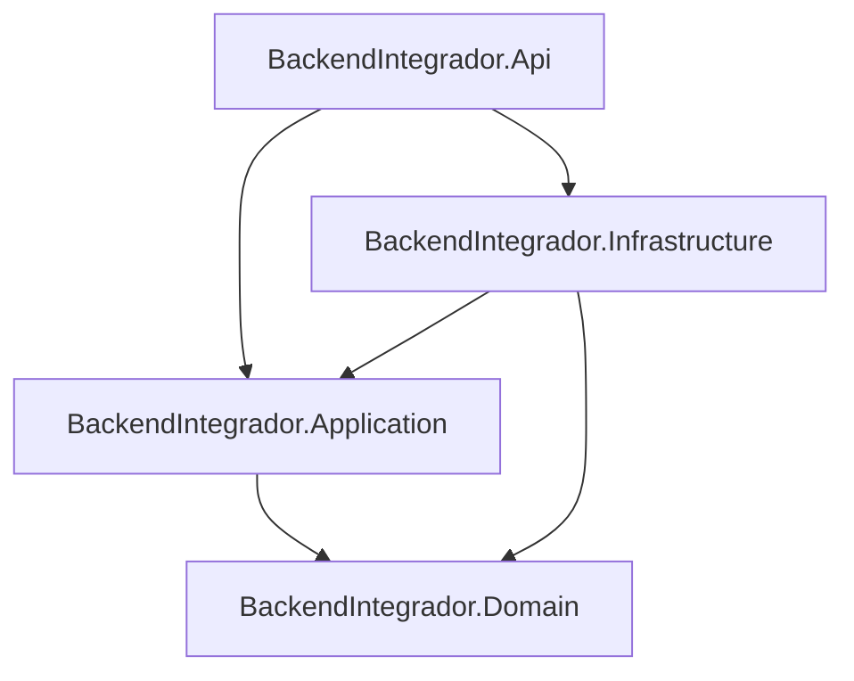

# BackendIntegrador

API REST en .NET 8 construida con Clean Architecture para gestionar el flujo de trazabilidad y calidad del proceso lechero:
usuarios, roles, productores, fincas, ordenos, lotes, transporte, recepcion en acopio y analisis de calidad.

## Arquitectura

El proyecto sigue una separacion por capas:

- `BackendIntegrador.Domain`: entidades y reglas de dominio.
- `BackendIntegrador.Application`: contratos (interfaces) y DTOs de aplicacion.
- `BackendIntegrador.Infrastructure`: implementaciones de persistencia (EF Core + SQLite), repositorio generico y servicios CRUD.
- `BackendIntegrador.Api`: controladores HTTP, configuracion de DI y Swagger.

Dependencias permitidas:



## Modelo de datos implementado

Entidades principales:

- `Usuario`
- `Rol`
- `UsuarioRol` (relacion N:M con llave compuesta)
- `Departamento`
- `Municipio`
- `CentroAcopio`
- `TipoDocumento`
- `Productor`
- `Finca`
- `Ordeno`
- `Transporte`
- `Lote`
- `RecepcionAcopio`
- `Muestra`
- `AnalisisCalidad`
- `ParametroCalidad`
- `ResultadoParametro` (relacion N:M con llave compuesta)

## CRUD disponible

Cada entidad con llave entera tiene CRUD completo (`GET all`, `GET by id`, `POST`, `PUT`, `DELETE`) bajo `/api/*`.

Controladores:

- `/api/usuarios`
- `/api/roles`
- `/api/departamentos`
- `/api/municipios`
- `/api/centros-acopio`
- `/api/tipos-documento`
- `/api/productores`
- `/api/fincas`
- `/api/ordenos`
- `/api/transportes`
- `/api/lotes`
- `/api/recepciones-acopio`
- `/api/muestras`
- `/api/analisis-calidad`
- `/api/parametros-calidad`

Relaciones con llave compuesta:

- `/api/usuario-roles`
  - `GET /api/usuario-roles`
  - `GET /api/usuario-roles/{usuarioId}/{rolId}`
  - `POST /api/usuario-roles`
  - `DELETE /api/usuario-roles/{usuarioId}/{rolId}`

- `/api/resultados-parametro`
  - `GET /api/resultados-parametro`
  - `GET /api/resultados-parametro/{analisisId}/{parametroId}`
  - `POST /api/resultados-parametro`
  - `PUT /api/resultados-parametro/{analisisId}/{parametroId}`
  - `DELETE /api/resultados-parametro/{analisisId}/{parametroId}`

## Persistencia

Se utiliza EF Core con SQLite:

- `DbContext`: `AppDbContext`
- Cadena de conexion por defecto en `src/BackendIntegrador.Api/appsettings.json`:
  - `ConnectionStrings:DefaultConnection = Data Source=integrador.db`

La API aplica migraciones al iniciar (`Database.Migrate()` en `Program.cs`).

## Ejecucion local

Desde la raiz del repositorio:

```bash
dotnet restore
dotnet build
dotnet run --project src/BackendIntegrador.Api/BackendIntegrador.Api.csproj
```

Swagger queda disponible en:

- `http://localhost:5111/swagger` (segun `launchSettings.json`)

## Estructura del repositorio

```text
BackendIntegrador/
├── src/
│   ├── BackendIntegrador.Domain/
│   ├── BackendIntegrador.Application/
│   ├── BackendIntegrador.Infrastructure/
│   └── BackendIntegrador.Api/
├── BackendIntegrador.sln
├── README.md
└── .gitignore
```
