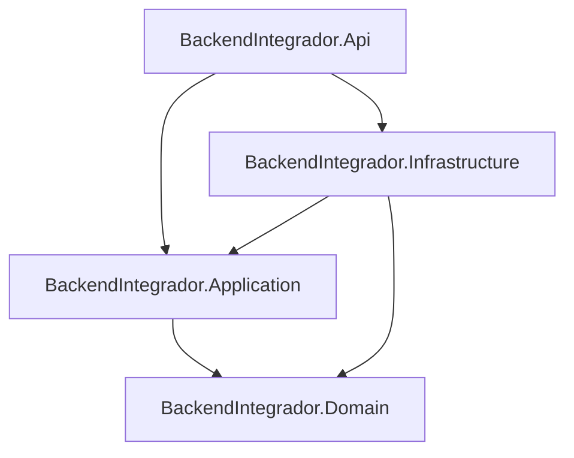

# BackendIntegrador

API backend en **.NET 8** organizada con **Clean Architecture** (arquitectura limpia). El objetivo es separar reglas de negocio, casos de uso, detalles técnicos y la interfaz HTTP para que el código sea más mantenible y testeable.

## Estructura del repositorio

```
BackendIntegrador/
├── src/
│   ├── BackendIntegrador.Domain/        # Núcleo: entidades y reglas puras
│   ├── BackendIntegrador.Application/   # Casos de uso y contratos (interfaces)
│   ├── BackendIntegrador.Infrastructure/# Implementaciones (BD, APIs externas, etc.)
│   └── BackendIntegrador.Api/           # Punto de entrada: HTTP, Swagger, DI
├── BackendIntegrador.sln
├── README.md
└── .gitignore
```

## Capas y dependencias

Las flechas indican **hacia quién puede depender cada proyecto** (solo hacia adentro del círculo):



| Proyecto | Rol |
|----------|-----|
| **Domain** | Entidades y lógica de dominio sin dependencias de frameworks. No referencia otros proyectos de la solución. |
| **Application** | Define *qué* hace el sistema: interfaces de repositorios/servicios, DTOs, validaciones de aplicación. Depende solo de **Domain**. |
| **Infrastructure** | *Cómo* se cumplen los contratos: Entity Framework, clientes HTTP, colas, implementaciones concretas. Depende de **Application** y **Domain**. |
| **Api** | ASP.NET Core: controladores, `Program.cs`, configuración HTTP y registro de servicios (incluye extensiones como `AddInfrastructure()`). Depende de **Application** e **Infrastructure**. |

La **Api** no debe contener lógica de negocio compleja: delega en servicios o casos de uso definidos en **Application**, que a su vez usan abstracciones implementadas en **Infrastructure**.

## Ejemplo incluido

El template de **WeatherForecast** sirve de guía:

- La entidad vive en **Domain** (`Entities/WeatherForecast`).
- El contrato `IWeatherForecastProvider` está en **Application** (`Abstractions/`).
- La implementación con datos aleatorios está en **Infrastructure** (`Weather/RandomWeatherForecastProvider`).
- El controlador en **Api** solo orquesta la petición HTTP y llama al proveedor inyectado.

## Cómo ejecutar

Desde la raíz del repositorio:

```bash
dotnet restore
dotnet build
dotnet run --project src/BackendIntegrador.Api/BackendIntegrador.Api.csproj
```

Abre Swagger en el puerto configurado en `src/BackendIntegrador.Api/Properties/launchSettings.json` (por defecto `http://localhost:5111/swagger`).

## Próximos pasos habituales

- Añadir **Entity Framework Core** en **Infrastructure** y repositorios que implementen interfaces de **Application**.
- Mover reglas de negocio a entidades o servicios de dominio en **Domain**.
- Añadir pruebas unitarias sobre **Application** y **Domain** sin levantar la web.

## .gitignore

El archivo `.gitignore` excluye carpetas de compilación (`bin/`, `obj/`), salidas de Visual Studio (`.vs/`), paquetes NuGet locales y otros artefactos para que no suban a GitHub.
