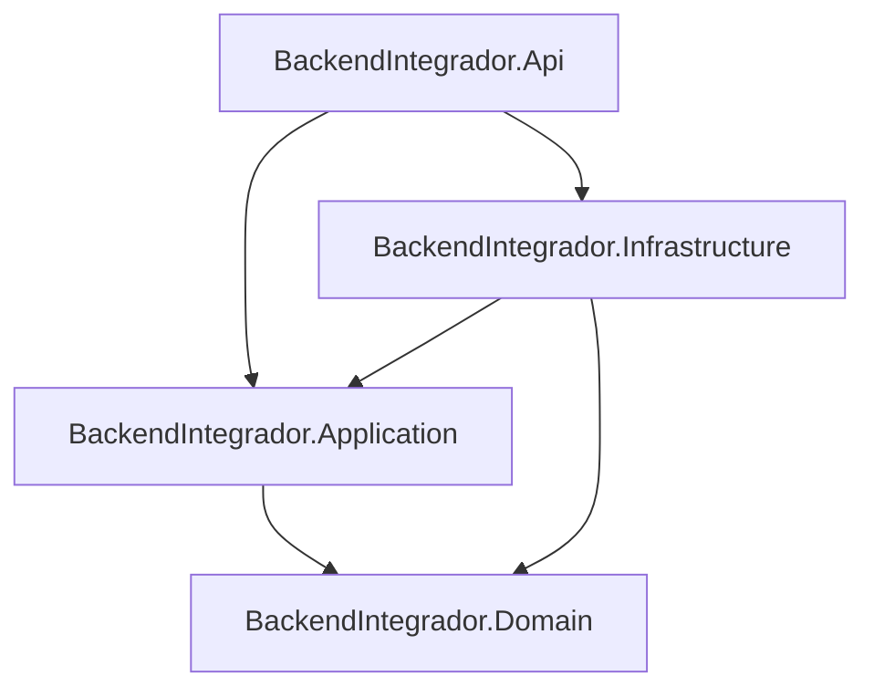
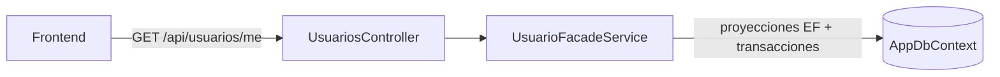
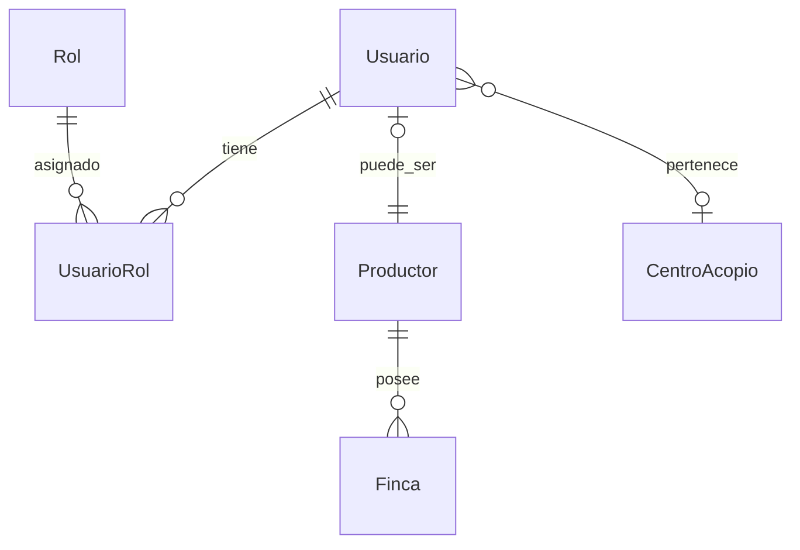

# BackendIntegrador

API REST en .NET 8 construida con Clean Architecture para gestionar el flujo de trazabilidad y calidad del proceso lechero: usuarios, roles, productores, fincas, ordeños, lotes, transporte, recepción en acopio y análisis de calidad.

El módulo de **usuarios** aplica el patrón **Facade** (orientado a pantallas del frontend): un solo endpoint devuelve perfil, roles, productor, fincas y alcance operativo, evitando el antipatrón de API fragmentada (*Chatty API*).

## Arquitectura

Separación por capas con dependencias unidireccionales:

| Capa | Proyecto | Responsabilidad |
|------|----------|-----------------|
| Dominio | `BackendIntegrador.Domain` | Entidades y reglas de dominio |
| Aplicación | `BackendIntegrador.Application` | Contratos (`I*Service`), DTOs y configuración compartida |
| Infraestructura | `BackendIntegrador.Infrastructure` | EF Core + SQLite, repositorio genérico, servicios CRUD y **Facade** |
| API | `BackendIntegrador.Api` | Controladores HTTP, autenticación JWT, Swagger |


```mermaid
flowchart TB
    Api[BackendIntegrador.Api]
    Infra[BackendIntegrador.Infrastructure]
    App[BackendIntegrador.Application]
    Dom[BackendIntegrador.Domain]

    Api --> App
    Api --> Infra
    Infra --> App
    Infra --> Dom
    App --> Dom
```

### Patrón Facade en usuarios


```mermaid
flowchart LR
    Client[Frontend]
    Ctrl[UsuariosController]
    Facade[UsuarioFacadeService]
    Db[(AppDbContext)]

    Client -->|"GET /api/usuarios/me"| Ctrl
    Ctrl --> Facade
    Facade -->|"proyecciones EF + transacciones"| Db
```

- **Lecturas:** consultas proyectadas con `.Select()` / `.Include()` en una sola ida a base de datos.
- **Escrituras:** operaciones transaccionales (`BeginTransactionAsync`) para crear o actualizar usuario, roles, productor y finca inicial en una petición.
- **Alcance:** no existe tabla `Permiso`; se deriva del rol, `CentroAcopioId` y relación `Productor` → `Fincas`.

## Estructura del repositorio

```text
BackendIntegrador/
├── src/
│   ├── BackendIntegrador.Domain/
│   │   └── Entities/              # Usuario, Rol, Productor, Finca, Lote, ...
│   ├── BackendIntegrador.Application/
│   │   ├── Abstractions/          # IRepository, ICrudService, IUsuarioFacadeService, ...
│   │   ├── Dtos/
│   │   │   ├── EntityDtos.cs      # DTOs CRUD por entidad + auth
│   │   │   └── UsuarioFacadeDtos.cs  # DTOs enriquecidos del módulo usuarios
│   │   └── Common/                # JwtSettings
│   ├── BackendIntegrador.Infrastructure/
│   │   ├── Persistence/           # AppDbContext, EfRepository
│   │   ├── Services/
│   │   │   ├── UsuarioFacadeService.cs   # Facade de usuarios
│   │   │   ├── UsuarioAlcanceHelper.cs   # Reglas de alcance derivado
│   │   │   ├── AuthenticationService.cs
│   │   │   ├── EntityCrudServices.cs     # CRUD genérico por entidad
│   │   │   └── ...
│   │   └── Migrations/
│   └── BackendIntegrador.Api/
│       ├── Controllers/
│       │   ├── UsuariosController.cs     # API consolidada de usuarios
│       │   ├── AuthController.cs
│       │   ├── IntKeyCrudControllerBase.cs
│       │   └── ...                       # CRUD del resto de entidades
│       ├── Attributes/            # AuthorizeRoleAttribute
│       ├── Middleware/
│       └── AUTHENTICATION.md
├── test/
│   ├── BackendIntegrador.Tests/           # Pruebas unitarias (Moq + xUnit)
│   └── BackendIntegrador.IntegrationTests/  # Pruebas de integración HTTP
├── BackendIntegrador.sln
├── BackendIntegrador.postman_collection.json
└── README.md
```

## Modelo de datos

Entidades principales:

- `Usuario`, `Rol`, `UsuarioRol` (N:M, llave compuesta)
- `Departamento`, `Municipio`, `CentroAcopio`, `TipoDocumento`
- `Productor`, `Finca`, `Ordeno`
- `Transporte`, `Lote`, `RecepcionAcopio`
- `Muestra`, `AnalisisCalidad`, `ParametroCalidad`, `ResultadoParametro` (N:M, llave compuesta)

Relaciones clave para usuarios:


```mermaid
erDiagram
    Usuario ||--o{ UsuarioRol : tiene
    Rol ||--o{ UsuarioRol : asignado
    Usuario |o--|| Productor : puede_ser
    Productor ||--o{ Finca : posee
    Usuario }o--o| CentroAcopio : pertenece
```

## Endpoints

### Autenticación — `/api/auth`

| Método | Ruta | Auth | Descripción |
|--------|------|------|-------------|
| POST | `/api/auth/login` | No | Login; retorna JWT + `AuthUsuarioDto` (roles y alcance resumido) |
| POST | `/api/auth/change-password` | Sí | Cambio de contraseña del usuario autenticado |

Detalle en [`src/BackendIntegrador.Api/AUTHENTICATION.md`](src/BackendIntegrador.Api/AUTHENTICATION.md).

### Usuarios (Facade) — `/api/usuarios`

| Método | Ruta | Auth | Descripción |
|--------|------|------|-------------|
| GET | `/api/usuarios` | Sí | Listado enriquecido (`UsuarioListadoDto`) |
| GET | `/api/usuarios/me` | Sí | Perfil del usuario autenticado |
| GET | `/api/usuarios/{id}` | Sí | Perfil completo (`UsuarioPerfilDto`) |
| POST | `/api/usuarios` | No | Alta transaccional (`ProvisionarUsuarioDto`) |
| PUT | `/api/usuarios/{id}` | Sí | Actualización transaccional (`ActualizarUsuarioDto`) |
| DELETE | `/api/usuarios/{id}` | Sí | Desactivación (`estado = inactivo`) |
| POST | `/api/usuarios/{id}/reset-password` | Sí | Restablecer contraseña |

**Ejemplo — provisionar usuario con rol:**

```json
POST /api/usuarios
{
  "email": "productor@finca.com",
  "password": "Secret123!",
  "estado": "activo",
  "centroAcopioId": null,
  "rolIds": [3],
  "productor": {
    "nombre": "María López",
    "documento": "98765432",
    "telefono": "3109876543",
    "tipoDocumentoId": 1,
    "fincaInicial": {
      "nombre": "El Roble",
      "direccion": "Vereda La Palma",
      "latitud": 4.6097,
      "longitud": -74.0817,
      "municipioId": 12
    }
  }
}
```

**Ejemplo — respuesta de perfil (`GET /api/usuarios/me`):**

```json
{
  "usuarioId": 1,
  "email": "productor@finca.com",
  "estado": "activo",
  "fechaCreacion": "2026-04-29T00:00:00Z",
  "centroAcopio": { "centroAcopioId": 2, "nombre": "Acopio Norte" },
  "roles": [{ "rolId": 3, "nombre": "Productor", "descripcion": "Productor lechero" }],
  "alcance": {
    "tipo": "productor",
    "productor": { "productorId": 10, "nombre": "Juan Pérez", "documento": "12345678", "telefono": "3001234567", "tipoDocumentoId": 1 },
    "fincas": [{ "fincaId": 5, "nombre": "La Esperanza", "municipioId": 12, "puedeOperar": true }]
  }
}
```

Valores de `alcance.tipo`: `admin` | `centro_acopio` | `productor` | `tecnico` | `sin_asignar`.

> **Nota:** `/api/usuario-roles` fue eliminado; la asignación de roles se gestiona dentro de `POST` y `PUT` de usuarios.

### CRUD por entidad — `/api/*`

Cada entidad con llave entera expone CRUD completo (`GET`, `GET/{id}`, `POST`, `PUT`, `DELETE`):

| Ruta | Entidad |
|------|---------|
| `/api/roles` | Rol |
| `/api/departamentos` | Departamento |
| `/api/municipios` | Municipio |
| `/api/centros-acopio` | Centro de acopio |
| `/api/tipos-documento` | Tipo de documento |
| `/api/productores` | Productor |
| `/api/fincas` | Finca |
| `/api/ordenos` | Ordeño |
| `/api/transportes` | Transporte |
| `/api/lotes` | Lote |
| `/api/recepciones-acopio` | Recepción en acopio |
| `/api/muestras` | Muestra |
| `/api/analisis-calidad` | Análisis de calidad |
| `/api/parametros-calidad` | Parámetro de calidad |

### Relaciones con llave compuesta

| Ruta | Descripción |
|------|-------------|
| `/api/resultados-parametro` | Resultado de parámetro por análisis (`analisisId` + `parametroId`) |

## Persistencia

- **ORM:** EF Core 8 + SQLite
- **DbContext:** `AppDbContext` en `Infrastructure/Persistence`
- **Conexión por defecto** (`appsettings.json`): `Data Source=integrador.db`
- Las migraciones se aplican al iniciar la API (`Database.Migrate()` en `Program.cs`)

## Ejecución local

Desde la raíz del repositorio:

```bash
dotnet restore
dotnet build
dotnet run --project src/BackendIntegrador.Api/BackendIntegrador.Api.csproj
```

Swagger: `http://localhost:5111/swagger` (según `launchSettings.json`).

## Pruebas

```bash
dotnet test test/BackendIntegrador.Tests/BackendIntegrador.Tests.csproj
dotnet test test/BackendIntegrador.IntegrationTests/BackendIntegrador.IntegrationTests.csproj
```

- **Unitarias:** controladores con Moq (`test/BackendIntegrador.Tests/`)
- **Integración:** API completa con SQLite en memoria (`test/BackendIntegrador.IntegrationTests/`)

Colección Postman: [`BackendIntegrador.postman_collection.json`](BackendIntegrador.postman_collection.json).
